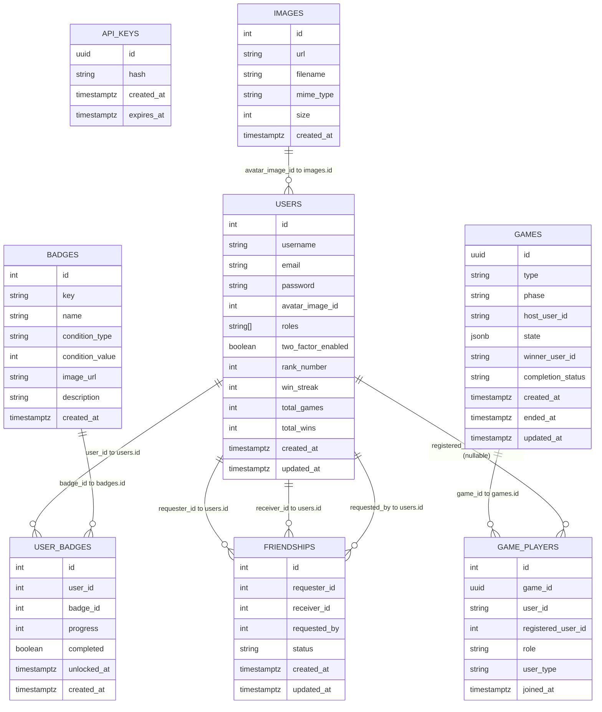

*This project has been created as part of the 42 curriculum by mzhivoto, mzhitnik, ekashirs, mlitvino, and imunaev-.*

# ft_transcendence — Maze is Lava

**A multiplayer real-time web game** built as part of the 42 curriculum by Marina Zhivotova, Mariia Zhytnikova, Evgeniia Kashirskaia, Mykhailo Litvinov, and Ilia Munaev.

---

## Description

Maze is Lava is a browser-based multiplayer puzzle game where players navigate tile-based boards, collect items, and compete for the top spot on the global leaderboard. The game supports both single-player and real-time multiplayer modes.

**Key features:**

- Real-time multiplayer gameplay over WebSockets (Socket.IO)
- Single-player puzzle levels with move and time limits
- User profiles with avatars, stats, and achievement badges
- Global leaderboard and friend system
- Authentication via local credentials, Google OAuth, and 42 Intra OAuth
- Two-factor authentication (2FA)
- Role-based access control (RBAC) with `user` and `admin` roles
- Microservices architecture with independent scaling
- Secrets management via HashiCorp Vault
- Web Application Firewall (ModSecurity) via Nginx
- REST API with full Swagger/OpenAPI documentation

Live application: **[https://valinor.ink/](https://valinor.ink/)**<br>
API documentation: **[https://valinor.ink/api/docs](https://valinor.ink/api/docs)**<br>
Architecture diagram: **[https://s.icepanel.io/GVOJBUo15pQ7B3/lvV5](https://s.icepanel.io/GVOJBUo15pQ7B3/lvV5)**<br>

---

## Instructions

### Prerequisites

- Docker and Docker Compose v5+
- A `.env` file with secrets (see `.env.example`)

### Environment setup

Copy the example environment

```bash
cp .env.example .env
```

### Install dependencies

```bash
make dev-install
```

### Run application in development mode

```bash
make dev
```

Required secrets include:

- `POSTGRES_PASSWORD` — database password
- `JWT_SECRET`, `API_KEY_SECRET` — auth secrets
- `INTRA_CLIENT_ID`, `INTRA_CLIENT_SECRET` — 42 Intra OAuth credentials
- `GOOGLE_CLIENT_ID`, `GOOGLE_CLIENT_SECRET` — Google OAuth credentials
- `MAIL_*` — SMTP credentials (Brevo relay)
- `ADMIN_PASSWORD` — initial admin account password

### Useful commands

| Command              | Description                                                                             |
| -------------------- | --------------------------------------------------------------------------------------- |
| `make dev-build`     | Build and start the development stack                                                    |
| `make dev-fclean`    | Stop and remove all production volumes                                                  |
| `make logs`          | Stream logs from all services                                                           |
| `make log-<service>` | Stream logs for one service (`core`, `auth`, `gateway`, `game`, `nginx`, `db`, `vault`) |
| `make down`          | Stop containers, keep volumes                                                           |
| `make fclean`        | Stop containers and remove volumes                                                      |
| `make prune`         | Remove dangling images                                                                  |

---

## Technical Stack

### Frontend


| Technology       | Purpose                           |
| ---------------- | --------------------------------- |
| React            | UI component framework            |
| Vite             | Build tool and dev server         |
| Tailwind CSS     | Utility-first styling             |
| React Router DOM | Client-side routing               |
| Socket.io-client | Real-time WebSocket communication |
| TypeScript       | Type safety                       |
| Vitest           | Unit and e2e tests                |


### Backend


| Technology      | Purpose                                         |
| --------------- | ----------------------------------------------- |
| NestJS          | Server framework                                |
| Fastify         | HTTP adapter (replaces Express for performance) |
| TypeORM         | ORM and schema migrations                       |
| Socket.IO       | WebSocket server                                |
| JWT             | Stateless authentication tokens                 |
| Swagger/OpenAPI | API documentation                               |
| Jest / ts-jest  | Backend testing                                 |


### Database

**PostgreSQL 17** — chosen for its reliability, JSONB support (used to store in-progress game state), and strong TypeORM integration. A single shared database is used across all backend services; schema changes are managed via TypeORM migrations.

### Database Schema

<details><summary>Screenshot</summary>

</details>

<details><summary>Mermaid Schema</summary>



</details>


### Infrastructure


| Technology              | Purpose                                             |
| ----------------------- | --------------------------------------------------- |
| Docker & Docker Compose | Container orchestration                             |
| Nginx                   | Reverse proxy, TLS termination, static file serving |
| ModSecurity (WAF)       | Web Application Firewall integrated with Nginx      |
| HashiCorp Vault         | Secrets management (AppRole auth in production)     |
| Hetzner VPS             | Production hosting                                  |


### Technical justifications

- **Microservices**: Each domain (auth, users, game) is independently deployable and can be scaled separately. The gateway service provides a single entry point for clients.
- **NestJS + Fastify**: NestJS offers a structured, Angular-inspired framework suited for large TypeScript backends. Fastify provides higher throughput than Express with near-identical API.
- **PostgreSQL + TypeORM**: JSONB columns allow storing complex game state without normalizing every field, while relational tables handle users, matches, and leaderboard data cleanly.
- **Vault**: Prevents secrets from being committed to version control. In production all credentials are injected at container startup via Vault's AppRole method.
- **In-memory game state**: Active game state lives in `EngineService`'s `Map<string, GameState>` for zero-latency reads during play; it is persisted to the database only when a game ends.

---

## Features List


| Feature                    | Description                                                                                               | Team member(s) |
| -------------------------- | --------------------------------------------------------------------------------------------------------- | -------------- |
| Single-player puzzle mode  | Navigate a tile-based board, collect items within move/time limits across multiple levels                 | Mariia, Marina, Evgeniia |
| Real-time multiplayer game | Up to N players on a shared board with turn-based board actions (shift, rotate, swap) and player movement | Mariia, Marina, Evgeniia |
| Multiplayer lobby          | Pre-game chat room and player ready system before match starts                                            | Mariia, Marina, Evgeniia |
| User profiles              | Avatar upload, stats display (games played, wins, rank, win streak)                                       | Marina, Mikhail, Evgeniia |
| Global leaderboard         | Ranked list of all users by win count and streak                                                          | Mikhail, Evgeniia  |
| Achievement badges         | Unlockable badges for reaching milestones (first game, 20 games, etc.)                                    | Mariia |
| Friend system              | Send/accept/reject/block friend requests; view friends list                                               | Mariia, Marina|
| Local authentication       | Register and log in with email + password (bcrypt-hashed)                                                 | Marina, Mikhail |
| Google OAuth               | Sign in with Google account                                                                               | Mikhail |
| 42 Intra OAuth             | Sign in with 42 school account                                                                            | Mikhail  |
| Two-factor authentication  | TOTP-based 2FA support for registered users                                                               | Mariia, Marina, Mikhail |
| Role-based access control  | `user`, `guest` and `admin` roles with decorator-based guards on all protected endpoints                           | Mariia, Marina, Mikhail |
| API key authentication     | Machine-to-machine authentication via `x-api-key` header                                                  | Mikhail  |
| REST API with Swagger      | Full OpenAPI documentation aggregated from all services, available at `/api/docs`                         | Mikhail  |
| WAF (ModSecurity)          | Web Application Firewall integrated with Nginx to filter malicious requests                               | Ilia  |
| Secrets management (Vault) | HashiCorp Vault manages all credentials with AppRole auth in production                                   | Ilia, Mikhail  |


---

## Modules

> Major module = 2 pts · Minor module = 1 pt · **Total: 27 pts**  
> Minimum required to pass: 14 pts.

### IV.1 — Web

| Module | Type | Pts | What the subject requires | How we implemented it | Team member(s) |
|--------|------|-----|--------------------------|----------------------|----------------|
| Frontend framework | Minor | 1 | Use a frontend framework (React, Vue, Angular, Svelte, etc.) | **React 18** with Vite as the build tool and Tailwind CSS for styling | To be updated |
| Backend framework | Minor | 1 | Use a backend framework (Express, Fastify, NestJS, Django, etc.) | **NestJS** with the Fastify HTTP adapter across all four backend services | To be updated |
| Real-time features (WebSockets) | Major | 2 | Real-time updates across clients; handle connection/disconnection gracefully; efficient message broadcasting | **Socket.IO** (`@nestjs/platform-socket.io`) powers live game state, in-game chat, lobby messages, and multiplayer-list updates. Disconnect/reconnect is handled in `WsGateway` | To be updated |
| User interaction | Major | 2 | Basic chat system (send/receive messages); profile system (view user information); friends system (add/remove friends, see friends list) | In-game and lobby **chat** over WebSockets; **profile pages** with stats and avatar; **friends** system with add/accept/reject/block via `Friendship` entity | To be updated |
| Public API | Major | 2 | Secured API key, rate limiting, documentation, at least 5 endpoints: GET, POST, PUT, DELETE | REST API secured via `x-api-key` header (HMAC-SHA256), rate-limited with `@nestjs/throttler`, full **Swagger/OpenAPI** docs at `/api/docs`, 5+ CRUD endpoints covering users, games, profiles, leaderboard | To be updated |
| ORM | Minor | 1 | Use an ORM for the database | **TypeORM** manages all entity definitions and runs TypeScript migrations via a dedicated migration container | To be updated |

### IV.3 — User Management

| Module | Type | Pts | What the subject requires | How we implemented it | Team member(s) |
|--------|------|-----|--------------------------|----------------------|----------------|
| Standard user management | Major | 2 | Update profile info; upload avatar (default if none); add friends and see online status; profile page | Users can edit their profile, upload an avatar (default avatar served if none set), add/remove friends, and see their friends' online status on their profile page | To be updated |
| Game statistics & match history | Minor | 1 | Track user game statistics (wins, losses, ranking, level, etc.); display match history; show achievements and progression; leaderboard integration | `users` table stores `totalGames`, `totalWins`, `winStreak`, `rankNumber`. Completed games are persisted to the `games` table. Leaderboard and per-user match history are exposed via the `core` service API | To be updated |
| Remote authentication (OAuth 2.0) | Minor | 1 | Implement remote authentication with OAuth 2.0 (Google, GitHub, 42, etc.) | **Google OAuth** and **42 Intra OAuth** via Passport.js strategies in the `auth` service; JWT cookie issued on successful OAuth callback | To be updated |
| Advanced permissions system | Major | 2 | View, edit, and delete users (CRUD); roles management (admin, user, guest, moderator, etc.); different views and actions based on user role | RBAC with `user` and `admin` roles stored in a PostgreSQL array. `@Auth()` and `@Roles()` decorators on all gateway routes enforce access. Admin users can perform full user CRUD; UI adapts to role | To be updated |
| Two-Factor Authentication (2FA) | Minor | 1 | Implement a complete 2FA system for users | TOTP-based 2FA: users enrol via QR code, and the `auth` service validates the one-time code at login before issuing the JWT cookie | To be updated |

### IV.5 — Cybersecurity

| Module | Type | Pts | What the subject requires | How we implemented it | Team member(s) |
|--------|------|-----|--------------------------|----------------------|----------------|
| WAF/ModSecurity + HashiCorp Vault | Major | 2 | Configure strict ModSecurity/WAF; manage secrets in Vault (API keys, credentials, environment variables), encrypted and isolated | **ModSecurity** with OWASP Core Rule Set embedded in the Nginx container filters all inbound traffic. **HashiCorp Vault** (AppRole auth in production) injects all credentials at container startup via `loadVaultSecrets()` — no secrets in images or environment files | To be updated |

### IV.6 — Gaming and User Experience

| Module | Type | Pts | What the subject requires | How we implemented it | Team member(s) |
|--------|------|-----|--------------------------|----------------------|----------------|
| Web-based game | Major | 2 | Real-time multiplayer game; live matches; clear rules and win/loss conditions; 2D or 3D | **Valinor** — a 2D tile-puzzle board game. Players navigate a sliding-tile board, collect items, and race to the exit. Clear win/loss conditions; single-player levels with move and time limits | To be updated |
| Remote players | Major | 2 | Two players on separate computers in real-time; handle network latency and disconnections gracefully; reconnection logic | All game state is broadcast via Socket.IO rooms (`play:<gameId>`). Disconnected players are detected by the `WsGateway` and the game can continue or be flagged as abandoned; clients reconnect by re-joining the room | To be updated |
| Multiplayer (3+ players) | Major | 2 | Support for three or more players simultaneously; fair gameplay mechanics; proper synchronization across all clients | The game engine supports an arbitrary number of players. Turn management (`advanceTurn()`) is fair round-robin; `PrivateGameState` per player ensures each client only receives its own data; board actions are broadcast to all | To be updated |
| Spectator mode | Minor | 1 | Allow users to watch ongoing games; real-time updates for spectators | Users with `role: SPECTATOR` in `GamePlayer` join the same Socket.IO room and receive all `playUpdate` events in real time without being able to take actions | To be updated |

### IV.7 — DevOps

| Module | Type | Pts | What the subject requires | How we implemented it | Team member(s) |
|--------|------|-----|--------------------------|----------------------|----------------|
| Backend as microservices | Major | 2 | Loosely-coupled services with clear interfaces; REST APIs or message queues for communication; each service has a single responsibility | Four services — **gateway** (routing + auth), **core** (users/profiles/leaderboard), **auth** (authentication/OAuth/2FA), **game** (game logic/WebSocket) — each containerised independently and communicating over HTTP REST | To be updated |

**Total: 10 major × 2 pts + 7 minor × 1 pt = 27 pts**

---

## Team Information


| Member               | Login    | Role(s)       | Responsibilities |
| -------------------- | -------- | ------------- | ---------------- |
| Marina Zhivotova     | mzhivoto | Product Owner / Developer  | Defines the product vision, prioritizes features, and ensures the project meets user needs. Implement features and modules.|
| Mariia Zhytnikova    | mzhitnik | Product Owner / Developer | Defines the product vision, prioritizes features, and ensures the project meets user needs. Implement features and modules.|
| Evgeniia Kashirskaia | ekashirs | Product Owner / Developer | Defines the product vision, prioritizes features, and ensures the project meets user needs. Implement features and modules.|
| Mykhailo Litvinov    | mlitvino | Technical Lead / Developer | Oversees technical decisions and architecture. Implement features and modules.|
| Ilia Munaev          | imunaev- | Project Manager / Developer | Organizes team meetings, tracks progress and deadlines, ensures team communication. Implement features and modules.|


---

## Individual Contributions

## Marina Zhivotova (`mzhivoto`)
**Role:** Product Owner / Developer

### Responsibilities
- Defined product vision and participated in feature prioritization
- Implemented core gameplay and backend functionality
- Contributed to authentication and security modules
- Participated in multiplayer systems and social features development

### Implemented Features
- Single-player puzzle mode
- Real-time multiplayer game
- Multiplayer lobby
- User profiles
- Friend system
- Local authentication
- Two-factor authentication
- Role-based access control

---

## Mariia Zhytnikova (`mzhitnik`)
**Role:** Product Owner / Developer

### Responsibilities
- Defined product vision and participated in feature prioritization
- Developed gameplay mechanics and multiplayer interaction systems
- Implemented user progression and security-related features
- Contributed to social systems and access control

### Implemented Features
- Single-player puzzle mode
- Real-time multiplayer game
- Multiplayer lobby
- Achievement badges
- Friend system
- Two-factor authentication
- Role-based access control

---

## Evgeniia Kashirskaia (`ekashirs`)
**Role:** Product Owner / Developer

### Responsibilities
- Defined product vision and participated in feature prioritization
- Developed gameplay systems and multiplayer functionality
- Implemented profile and ranking-related modules
- Contributed to API integration and frontend/backend interaction

### Implemented Features
- Single-player puzzle mode
- Real-time multiplayer game
- Multiplayer lobby
- User profiles
- Global leaderboard

---

## Mykhailo Litvinov (`mlitvino`)
**Role:** Technical Lead / Developer

### Responsibilities
- Oversaw technical architecture and engineering decisions
- Implemented authentication and API infrastructure
- Developed security-related modules and service integrations
- Managed backend documentation and production integrations

### Implemented Features
- User profiles
- Global leaderboard
- Local authentication
- Google OAuth
- 42 Intra OAuth
- Two-factor authentication
- Role-based access control
- API key authentication
- REST API with Swagger
- Secrets management with HashiCorp Vault

---

## Ilia Munaev (`imunaev-`)
**Role:** Project Manager / Developer

### Responsibilities
- Organized team meetings and coordinated development workflow
- Tracked progress, deadlines, and communication between team members

### Implemented Features
- WAF (ModSecurity)
- Secrets management with HashiCorp Vault

---

## Project Management

**Task distribution:** Tasks were distributed by feature domain. Each team member owned one or more modules end-to-end (frontend + backend). Assignments are detailed in the Features List and Individual Contributions sections above. 

**Project management tools:** GitHub Issues and GitHub Projects — used to track tasks, bugs, and feature progress. Pull requests to the `development` branch required review before merge. CI runs automatically on every PR via GitHub Actions.

**Communication channels:** Discord — primary channel for daily communication, code reviews, and async updates. In-person meetings at Hive Helsinki campus for planning and unblocking sessions.

**Meeting cadence:** Weekly planning meetings to set goals and review progress. Ad-hoc syncs as needed when blockers arose. Final integration and testing sessions held in the last week before evaluation.

---

## Resources

### Documentation & References

- [NestJS Documentation](https://docs.nestjs.com/)
- [React Documentation](https://react.dev/)
- [TypeORM Documentation](https://typeorm.io/)
- [Socket.IO Documentation](https://socket.io/docs/)
- [HashiCorp Vault Documentation](https://developer.hashicorp.com/vault/docs)
- [PostgreSQL 17 Documentation](https://www.postgresql.org/docs/17/)
- [ModSecurity Reference Manual](https://github.com/owasp-modsecurity/ModSecurity/wiki/Reference-Manual)
- [Nginx Documentation](https://nginx.org/en/docs/)
- [Vite Documentation](https://vite.dev/)
- [Docker Compose Documentation](https://docs.docker.com/compose/)

### AI Usage

AI assistants (Claude, ChatGPT, Copilot ) were used during development for:

- Debugging complex TypeScript type errors and NestJS module configuration issues
- Drafting boilerplate for new NestJS modules, guards, and decorators
- Suggesting approaches for WebSocket event handling and game state synchronization
- Reviewing Vault AppRole configuration and Docker Compose service wiring
- Generating initial Swagger annotations for REST endpoints
- Assisting with Tailwind CSS layout questions on the frontend

All AI-generated code was reviewed, tested, and integrated by the team.

---

## Known Limitations

- Vault data is in-memory in dev mode and lost on container restart — re-seed before each dev session.
  
---

## License

- This project has been created as part of the 42 curriculum. It is intended for educational use.
- MIT.
